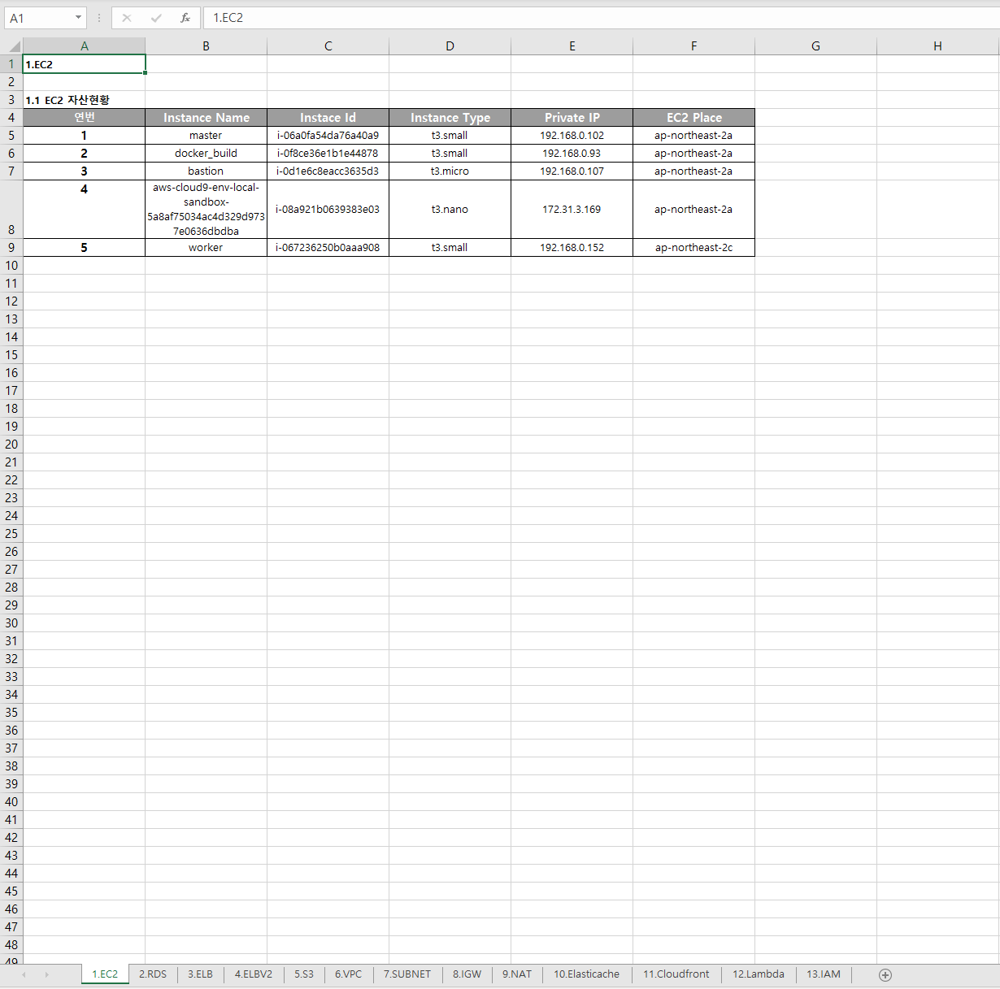
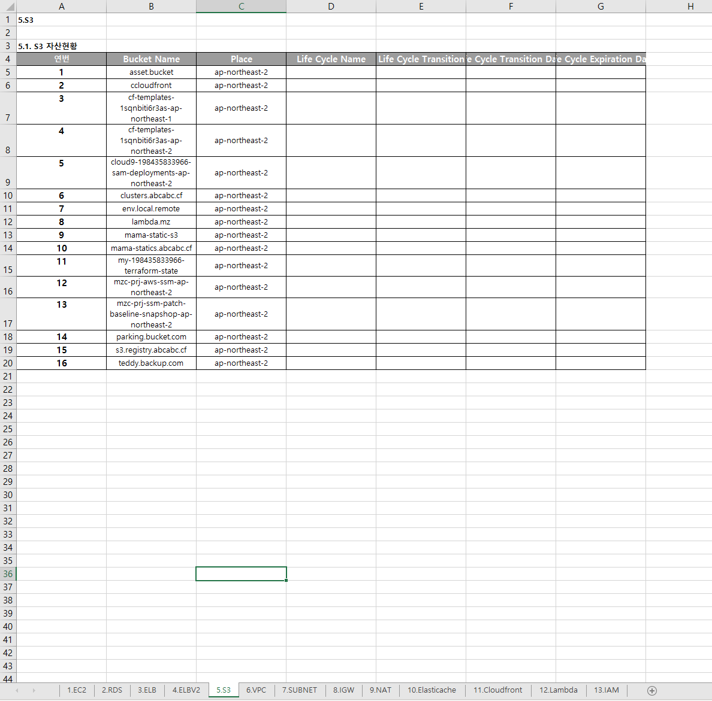

### AWS 리소스 리스트 엑셀 출력

---
+ ### 필요 라이브러리
  - pandas (데이터 프레임, 엑셀 조작)
  - concurrent.futures (병렬 작업 처리)
    
+ ### 전제 조건
  - 출력이 필요한 계정의 Access Key, Secret Key 필요

+ ### 사용 이유
  - 리소스 출력을 통한 현황 확인
    
+ ### 출력 결과물

